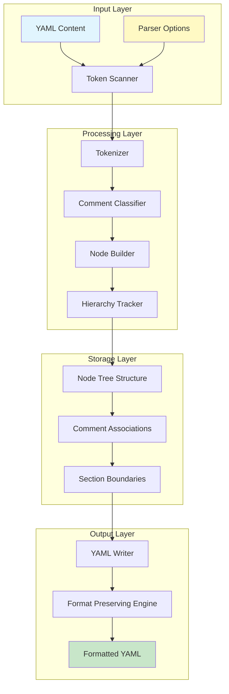
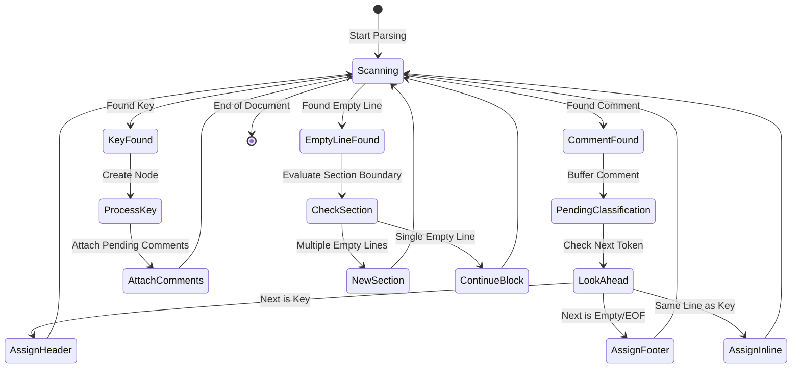
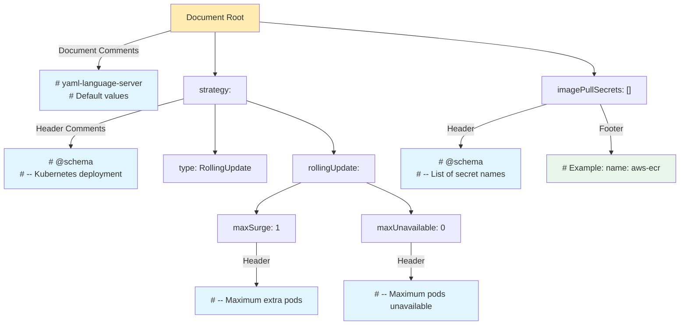
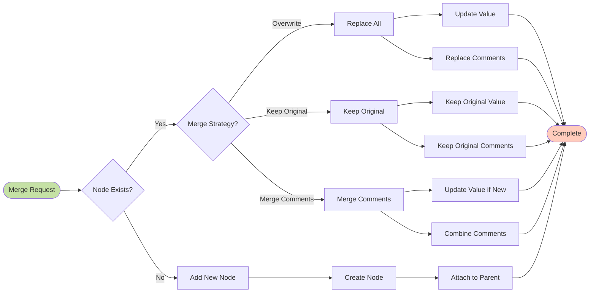
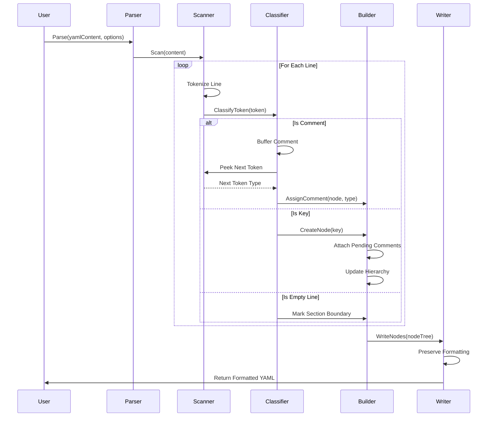
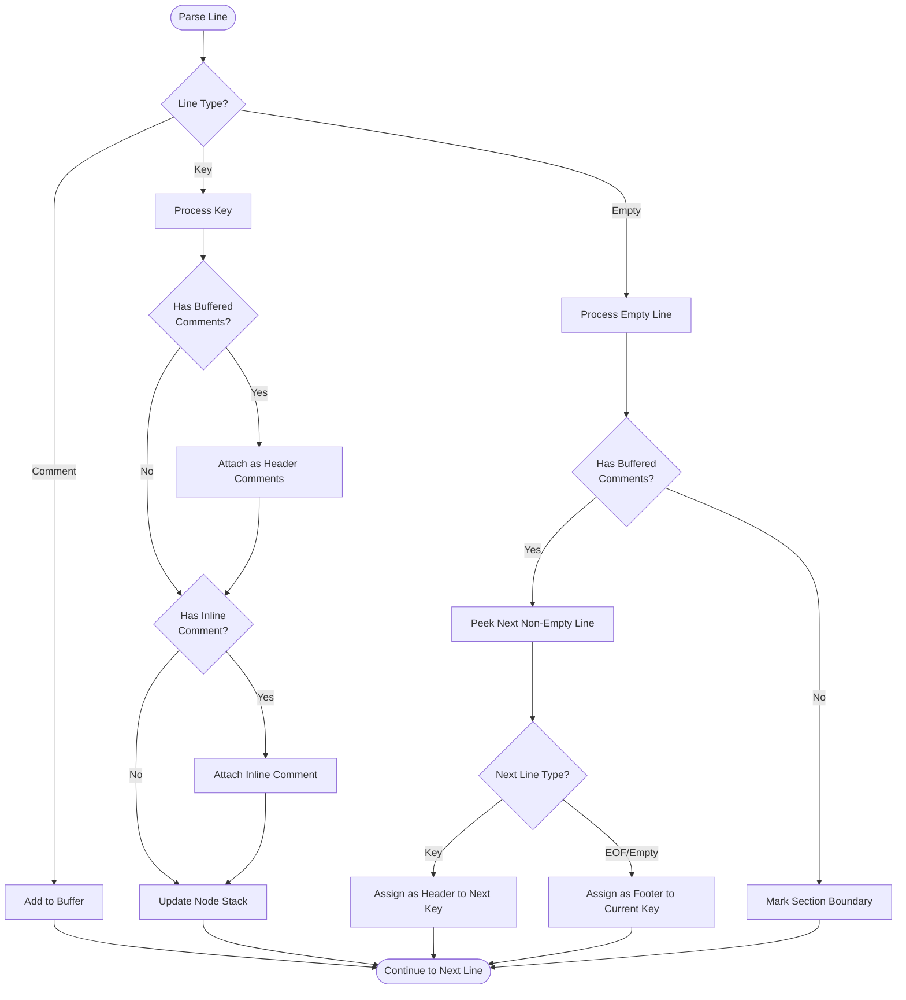
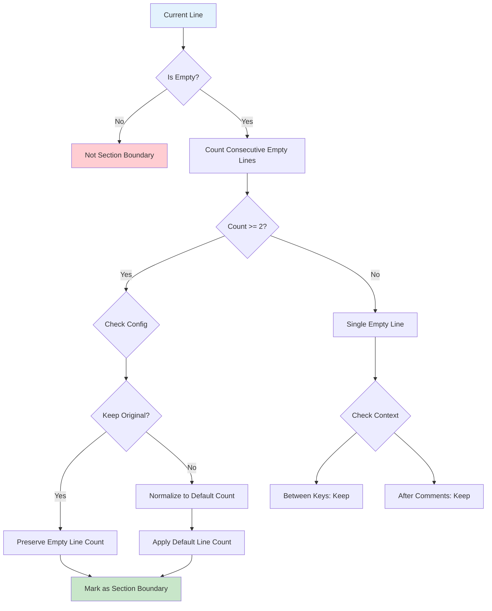

# YAML Parser: Comments and Empty Lines Handling

## Problem Statement

The current YAML parser implementation has several critical issues with comment and empty line handling:

### Issue 1: Incorrect Comment Association
Comments are not properly associated with their hierarchical parent nodes. For example:

```yaml
# @schema
# additionalProperties: true
# @schema
# -- Pod Disruption Budget configuration
podDisruptionBudget:
  # -- Enable Pod Disruption Budget (THIS IS A HEAD COMMENT FOR 'enabled')
  enabled: false
  # -- Maximum pods unavailable (THIS IS A HEAD COMMENT FOR 'maxUnavailable')
  maxUnavailable: 1
  # Alternative: minAvailable: 1 (THIS IS A FOOTER COMMENT FOR 'maxUnavailable')
```

**Current Problem**: The parser incorrectly adds empty lines and doesn't properly track the hierarchical relationship between comments and their parent/child nodes.

### Issue 2: Comment Classification Logic

The parser needs to implement a sophisticated algorithm to correctly classify comments:

1. **Head Comments**: Comments that appear before a key
2. **Line Comments**: Comments on the same line as a key
3. **Footer Comments**: Comments that appear after a key's value
4. **Document Comments**: Comments at the document start before any keys

### Issue 3: Empty Line Handling

Empty lines serve as section delimiters but are currently not handled correctly:
- Unnecessary empty lines are added during reconstruction
- Section boundaries are not properly detected
- Merging doesn't preserve the correct empty line structure

## Solution Architecture

### Comment Association Algorithm

The solution implements a hierarchical comment tracking system that properly associates comments with their respective nodes:

```text
Document Start
    ├── Document Comments (before any keys)
    └── Root Node
        ├── Head Comments (before the key)
        ├── Line Comment (on same line as key)
        ├── Child Nodes
        │   ├── Head Comments
        │   ├── Line Comment
        │   └── Footer Comments
        └── Footer Comments (after value, before next key/section)
```

### Key Algorithm Components

#### 1. Comment Classification State Machine

```go
type CommentContext struct {
    CurrentIndent    int
    ParentNode      *NodeRef
    PendingComments []string
    LastTokenType   TokenType
}

type TokenType int
const (
    TokenComment TokenType = iota
    TokenEmptyLine
    TokenKey
    TokenValue
)
```

The parser maintains state to determine comment ownership:
- Track indentation levels to establish hierarchy
- Buffer comments until their owner is determined
- Use empty lines as section boundaries

#### 2. Hierarchical Comment Assignment Logic

```pseudocode
for each line in document:
    if is_comment(line):
        add to pending_comments
    elif is_empty_line(line):
        if pending_comments:
            check_next_token()
            if next_is_key:
                assign_as_head_comments(next_key)
            else:
                assign_as_footer_comments(current_key)
        mark_section_boundary()
    elif is_key(line):
        if has_pending_comments:
            assign_head_comments(key)
        if has_inline_comment:
            assign_line_comment(key)
        update_hierarchy_stack(key)
```

### Improved Parser Implementation

yaml_parser.go

```go
package main

import (
	"fmt"
	"regexp"
	"strings"
)

type NodeRef struct {
	Path           []string
	Line           int
	Column         int
	Depth          int
	HasEmpty       bool
	HeaderComments []string
	FooterComments []string
	Value          string
}

type CommentBlock struct {
	StartLine int
	EndLine   int
	Content   []string
	NodeRef   *NodeRef
}

type YAMLParser struct {
	lines         []string
	currentLine   int
	nodeStack     []*NodeRef
	commentBlocks []CommentBlock
}

func NewYAMLParser(content string) *YAMLParser {
	lines := strings.Split(content, "\n")
	return &YAMLParser{
		lines:         lines,
		nodeStack:     make([]*NodeRef, 0),
		commentBlocks: make([]CommentBlock, 0),
	}
}

func (p *YAMLParser) getIndentLevel(line string) int {
	for i, char := range line {
		if char != ' ' && char != '\t' {
			return i
		}
	}
	return len(line)
}

func (p *YAMLParser) isEmptyLine(line string) bool {
	return strings.TrimSpace(line) == ""
}

func (p *YAMLParser) isCommentLine(line string) bool {
	trimmed := strings.TrimSpace(line)
	return strings.HasPrefix(trimmed, "#")
}

func (p *YAMLParser) extractKey(line string) string {
	keyRegex := regexp.MustCompile(`^(\s*)([^:]+):`)
	matches := keyRegex.FindStringSubmatch(line)
	if len(matches) >= 3 {
		return strings.TrimSpace(matches[2])
	}
	return ""
}

func (p *YAMLParser) extractValue(line string) string {
	keyRegex := regexp.MustCompile(`^(\s*)([^:]+):\s*(.*)$`)
	matches := keyRegex.FindStringSubmatch(line)
	if len(matches) >= 4 {
		return strings.TrimSpace(matches[3])
	}
	return ""
}

func (p *YAMLParser) findFirstKey() *NodeRef {
	for i, line := range p.lines {
		if p.isEmptyLine(line) || p.isCommentLine(line) {
			continue
		}

		key := p.extractKey(line)
		if key != "" {
			return &NodeRef{
				Path:     []string{key},
				Line:     i + 1,
				Column:   p.getIndentLevel(line),
				Depth:    0,
				HasEmpty: false,
			}
		}
	}
	return nil
}

func (p *YAMLParser) findPreviousEmptyLine(startLine int) int {
	for i := startLine - 1; i >= 0; i-- {
		if p.isEmptyLine(p.lines[i]) {
			return i
		}
		if !p.isCommentLine(p.lines[i]) {
			break
		}
	}
	return -1
}

func (p *YAMLParser) hasEmptyLineAbove(lineNum int) bool {
	if lineNum <= 0 {
		return false
	}
	return p.isEmptyLine(p.lines[lineNum-1])
}

func (p *YAMLParser) countConsecutiveEmptyLines(startLine int) int {
	count := 0
	for i := startLine; i >= 0; i-- {
		if p.isEmptyLine(p.lines[i]) {
			count++
		} else {
			break
		}
	}
	return count
}

func (p *YAMLParser) extractCommentsAndEmptyLines(endLine int) ([]string, int) {
	comments := make([]string, 0)
	emptyLinesCount := 0

	for i := endLine - 1; i >= 0; i-- {
		line := p.lines[i]

		if p.isEmptyLine(line) {
			emptyLinesCount++
			comments = append([]string{"##EMPTY_LINE##"}, comments...)
		} else if p.isCommentLine(line) {
			trimmed := strings.TrimSpace(line)
			comment := strings.TrimPrefix(trimmed, "#")
			comment = strings.TrimSpace(comment)
			comments = append([]string{comment}, comments...)
		} else {
			break
		}
	}

	return comments, emptyLinesCount
}

func (p *YAMLParser) extractAllCommentsAndEmptyLinesBeforeFirstKey() ([]string, int) {
	firstKey := p.findFirstKey()
	if firstKey == nil {
		return nil, 0
	}

	comments := make([]string, 0)
	emptyLinesCount := 0

	for i := 0; i < firstKey.Line-1; i++ {
		line := p.lines[i]

		if p.isEmptyLine(line) {
			emptyLinesCount++
			comments = append(comments, "##EMPTY_LINE##")
		} else if p.isCommentLine(line) {
			trimmed := strings.TrimSpace(line)
			comment := strings.TrimPrefix(trimmed, "#")
			comment = strings.TrimSpace(comment)
			comments = append(comments, comment)
		}
	}

	return comments, emptyLinesCount
}

func (p *YAMLParser) findLastKey() *NodeRef {
	var lastKey *NodeRef
	for i := len(p.lines) - 1; i >= 0; i-- {
		line := p.lines[i]
		if !p.isEmptyLine(line) && !p.isCommentLine(line) {
			key := p.extractKey(line)
			if key != "" {
				indentLevel := p.getIndentLevel(line)
				path := p.buildNodePath(i, indentLevel)
				lastKey = &NodeRef{
					Path:   path,
					Line:   i + 1,
					Column: indentLevel,
					Depth:  len(path) - 1,
				}
				break
			}
		}
	}
	return lastKey
}

func (p *YAMLParser) extractFooterComments() []string {
	lastKey := p.findLastKey()
	if lastKey == nil {
		return nil
	}

	comments := make([]string, 0)

	for i := lastKey.Line; i < len(p.lines); i++ {
		line := p.lines[i]

		if p.isEmptyLine(line) {
			comments = append(comments, "##EMPTY_LINE##")
		} else if p.isCommentLine(line) {
			trimmed := strings.TrimSpace(line)
			comment := strings.TrimPrefix(trimmed, "#")
			comment = strings.TrimSpace(comment)
			comments = append(comments, comment)
		}
	}

	return comments
}

func (p *YAMLParser) buildNodePath(line int, indentLevel int) []string {
	path := make([]string, 0)
	currentIndent := indentLevel

	for i := line - 1; i >= 0; i-- {
		if p.isEmptyLine(p.lines[i]) || p.isCommentLine(p.lines[i]) {
			continue
		}

		lineIndent := p.getIndentLevel(p.lines[i])
		key := p.extractKey(p.lines[i])

		if key != "" && lineIndent < currentIndent {
			path = append([]string{key}, path...)
			currentIndent = lineIndent
		}

		if lineIndent == 0 {
			break
		}
	}

	currentKey := p.extractKey(p.lines[line])
	if currentKey != "" {
		path = append(path, currentKey)
	}

	return path
}

func (p *YAMLParser) generateCommentBlock(nodeRef *NodeRef) CommentBlock {
	pathStr := strings.Join(nodeRef.Path, ".")

	commentContent := []string{
		fmt.Sprintf("# Node: %s", pathStr),
		fmt.Sprintf("# Line: %d", nodeRef.Line),
		fmt.Sprintf("# Depth: %d", nodeRef.Depth),
		fmt.Sprintf("# Path: %s", pathStr),
	}

	if nodeRef.HasEmpty {
		commentContent = append(commentContent, "# Has empty line above: true")
	}

	return CommentBlock{
		StartLine: nodeRef.Line - len(commentContent) - 1,
		EndLine:   nodeRef.Line - 1,
		Content:   commentContent,
		NodeRef:   nodeRef,
	}
}

func (p *YAMLParser) Parse() {
	firstKey := p.findFirstKey()
	if firstKey == nil {
		return
	}

	firstKeyLine := firstKey.Line
	isFirstKey := true
	footerComments := p.extractFooterComments()
	lastKey := p.findLastKey()

	for i, line := range p.lines {
		if p.isEmptyLine(line) || p.isCommentLine(line) {
			continue
		}

		key := p.extractKey(line)
		if key == "" {
			continue
		}

		indentLevel := p.getIndentLevel(line)
		path := p.buildNodePath(i, indentLevel)
		hasEmpty := p.hasEmptyLineAbove(i)
		value := p.extractValue(line)

		var headerComments []string
		var nodeFooterComments []string

		if isFirstKey && i+1 == firstKeyLine {
			headerComments, _ = p.extractAllCommentsAndEmptyLinesBeforeFirstKey()
			isFirstKey = false
		} else {
			headerComments, _ = p.extractCommentsAndEmptyLines(i)
		}

		if lastKey != nil && i+1 == lastKey.Line {
			nodeFooterComments = footerComments
		} else {
			nodeFooterComments = make([]string, 0)
		}

		nodeRef := &NodeRef{
			Path:           path,
			Line:           i + 1,
			Column:         indentLevel,
			Depth:          len(path) - 1,
			HasEmpty:       hasEmpty,
			HeaderComments: headerComments,
			FooterComments: nodeFooterComments,
			Value:          value,
		}

		if len(headerComments) > 0 || len(nodeFooterComments) > 0 {
			commentBlock := p.generateCommentBlock(nodeRef)
			p.commentBlocks = append(p.commentBlocks, commentBlock)
		}

		p.nodeStack = append(p.nodeStack, nodeRef)
	}
}

func (p *YAMLParser) GetFirstKey() *NodeRef {
	return p.findFirstKey()
}

func (p *YAMLParser) GetCommentBlocks() []CommentBlock {
	return p.commentBlocks
}

func (p *YAMLParser) GetNodeStack() []*NodeRef {
	return p.nodeStack
}

func (p *YAMLParser) WriteBackToYAML() string {
	var result strings.Builder

	firstKey := p.GetFirstKey()
	if firstKey == nil {
		return ""
	}

	firstNode := p.nodeStack[0]

	for _, comment := range firstNode.HeaderComments {
		result.WriteString("# " + comment + "\n")
	}

	for _, node := range p.nodeStack {
		indent := strings.Repeat("  ", node.Depth)

		if node.Depth == 0 {
			result.WriteString(node.Path[len(node.Path)-1] + ":\n")
		} else {
			result.WriteString(indent + node.Path[len(node.Path)-1] + ":\n")
		}
	}

	return result.String()
}

func (p *YAMLParser) WriteBackToYAMLWithValues() string {
	originalLines := p.lines
	var result strings.Builder

	firstNode := p.nodeStack[0]

	for _, comment := range firstNode.HeaderComments {
		if comment == "##EMPTY_LINE##" {
			result.WriteString("\n")
		} else {
			result.WriteString("# " + comment + "\n")
		}
	}

	processedLines := make(map[int]bool)

	for _, node := range p.nodeStack {
		lineIndex := node.Line - 1
		if processedLines[lineIndex] {
			continue
		}
		processedLines[lineIndex] = true

		if lineIndex < len(originalLines) {
			line := originalLines[lineIndex]
			result.WriteString(line + "\n")

			for i := lineIndex + 1; i < len(originalLines); i++ {
				nextLine := originalLines[i]
				if p.isEmptyLine(nextLine) || p.isCommentLine(nextLine) {
					if !p.isNodeLine(i) {
						result.WriteString(nextLine + "\n")
						processedLines[i] = true
					} else {
						break
					}
				} else if p.extractKey(nextLine) != "" {
					break
				} else {
					result.WriteString(nextLine + "\n")
					processedLines[i] = true
				}
			}
		}
	}

	for _, node := range p.nodeStack {
		if len(node.FooterComments) > 0 {
			for _, comment := range node.FooterComments {
				if comment == "##EMPTY_LINE##" {
					result.WriteString("\n")
				} else {
					result.WriteString("# " + comment + "\n")
				}
			}
			break
		}
	}

	return result.String()
}

func (p *YAMLParser) isNodeLine(lineIndex int) bool {
	for _, node := range p.nodeStack {
		if node.Line-1 == lineIndex {
			return true
		}
	}
	return false
}

func (p *YAMLParser) PrintAnalysis() {
	firstKey := p.GetFirstKey()
	if firstKey != nil {
		fmt.Printf("First Key: %s at line %d\n", firstKey.Path[0], firstKey.Line)
	}

	fmt.Println("\n" + strings.Repeat("=", 60))
	fmt.Println("KEYS WITH HEADER COMMENTS DEMONSTRATION:")
	fmt.Println(strings.Repeat("=", 60))

	keysWithHeaders := 0
	for _, node := range p.nodeStack {
		if len(node.HeaderComments) > 0 {
			keysWithHeaders++
			fmt.Printf("\n🔸 KEY: %s (line:%d)\n", strings.Join(node.Path, "."), node.Line)
			fmt.Printf("   Header Comments: %d\n", len(node.HeaderComments))
			fmt.Println("   ┌─────────────────────────────────────────────────")
			for i, comment := range node.HeaderComments {
				if comment == "##EMPTY_LINE##" {
					fmt.Printf("   │ [%d] (empty line)\n", i+1)
				} else {
					fmt.Printf("   │ [%d] %s\n", i+1, comment)
				}
			}
			fmt.Println("   └─────────────────────────────────────────────────")
		}
	}

	if keysWithHeaders == 0 {
		fmt.Println("No keys found with header comments.")
	} else {
		fmt.Printf("\nTotal keys with header comments: %d\n", keysWithHeaders)
	}

	fmt.Println("\n" + strings.Repeat("=", 60))
	fmt.Println("COMPLETE NODE TREE:")
	fmt.Println(strings.Repeat("=", 60))
	for _, node := range p.nodeStack {
		indent := strings.Repeat("  ", node.Depth)
		indicators := make([]string, 0)

		if node.HasEmpty {
			indicators = append(indicators, "EMPTY")
		}

		if len(node.HeaderComments) > 0 {
			indicators = append(indicators, fmt.Sprintf("HEADER:%d", len(node.HeaderComments)))
		}

		if len(node.FooterComments) > 0 {
			indicators = append(indicators, fmt.Sprintf("FOOTER:%d", len(node.FooterComments)))
		}

		indicatorStr := ""
		if len(indicators) > 0 {
			indicatorStr = fmt.Sprintf(" [%s]", strings.Join(indicators, ", "))
		}

		fmt.Printf("%s%s (line:%d, depth:%d)%s\n",
			indent, strings.Join(node.Path, "."), node.Line, node.Depth, indicatorStr)

		if len(node.HeaderComments) > 0 {
			fmt.Printf("%s  HEADER COMMENTS:\n", indent)
			for _, comment := range node.HeaderComments {
				fmt.Printf("%s    # %s\n", indent, comment)
			}
		}

		if len(node.FooterComments) > 0 {
			fmt.Printf("%s  FOOTER COMMENTS:\n", indent)
			for _, comment := range node.FooterComments {
				fmt.Printf("%s    # %s\n", indent, comment)
			}
		}
	}

	fmt.Println("\n" + strings.Repeat("=", 60))
	fmt.Println("GENERATED COMMENT BLOCKS:")
	fmt.Println(strings.Repeat("=", 60))
	for _, block := range p.commentBlocks {
		fmt.Printf("Block for node: %s\n", strings.Join(block.NodeRef.Path, "."))
		fmt.Printf("  Header Comments: %d\n", len(block.NodeRef.HeaderComments))
		fmt.Printf("  Footer Comments: %d\n", len(block.NodeRef.FooterComments))
		for _, comment := range block.Content {
			fmt.Printf("  %s\n", comment)
		}
		fmt.Println()
	}
}

type MergeStrategy int

const (
	MergeStrategyOverwrite MergeStrategy = iota
	MergeStrategyKeepOriginal
	MergeStrategyMergeComments
)

func (p *YAMLParser) MergeWith(otherContent string, strategy MergeStrategy) error {
	otherParser := NewYAMLParser(otherContent)
	otherParser.Parse()

	mergedNodes := make([]*NodeRef, 0)
	nodeMap := make(map[string]*NodeRef)

	for _, node := range p.nodeStack {
		nodeKey := strings.Join(node.Path, ".")
		nodeMap[nodeKey] = node
		mergedNodes = append(mergedNodes, node)
	}

	addedChildrenToParents := make(map[string]bool)

	for _, otherNode := range otherParser.nodeStack {
		nodeKey := strings.Join(otherNode.Path, ".")

		if existingNode, exists := nodeMap[nodeKey]; exists {
			switch strategy {
			case MergeStrategyOverwrite:
				existingNode.HeaderComments = otherNode.HeaderComments
				existingNode.FooterComments = otherNode.FooterComments
				if otherNode.Value != "" {
					existingNode.Value = otherNode.Value
				}
			case MergeStrategyKeepOriginal:
			case MergeStrategyMergeComments:
				existingNode.HeaderComments = p.mergeComments(existingNode.HeaderComments, otherNode.HeaderComments)
				existingNode.FooterComments = p.mergeComments(existingNode.FooterComments, otherNode.FooterComments)
				if otherNode.Value != "" {
					existingNode.Value = otherNode.Value
				}
			}
		} else {
			mergedNodes = append(mergedNodes, otherNode)
			nodeMap[nodeKey] = otherNode

			if otherNode.Depth > 0 {
				parentPath := strings.Join(otherNode.Path[:len(otherNode.Path)-1], ".")
				addedChildrenToParents[parentPath] = true
			}
		}
	}

	for parentPath := range addedChildrenToParents {
		if parentNode, exists := nodeMap[parentPath]; exists {
			if parentNode.Value == "[]" || strings.TrimSpace(parentNode.Value) == "" {
				parentNode.Value = ""
			}
		}
	}

	p.nodeStack = mergedNodes
	p.rebuildLines()
	return nil
}

func (p *YAMLParser) mergeComments(original, new []string) []string {
	merged := make([]string, 0)

	merged = append(merged, original...)

	if len(original) > 0 && len(new) > 0 {
		merged = append(merged, "##EMPTY_LINE##")
	}

	merged = append(merged, new...)

	return merged
}

func (p *YAMLParser) rebuildLines() {
	var newLines []string

	firstNode := p.getFirstNodeInTree()
	if firstNode != nil {
		for _, comment := range firstNode.HeaderComments {
			if comment == "##EMPTY_LINE##" {
				newLines = append(newLines, "")
			} else {
				newLines = append(newLines, "# "+comment)
			}
		}
	}

	processedPaths := make(map[string]bool)
	parentNodes := make(map[string][]*NodeRef)

	for _, node := range p.nodeStack {
		if node.Depth > 0 {
			parentPath := strings.Join(node.Path[:len(node.Path)-1], ".")
			parentNodes[parentPath] = append(parentNodes[parentPath], node)
		}
	}

	for _, node := range p.nodeStack {
		pathKey := strings.Join(node.Path, ".")
		if processedPaths[pathKey] {
			continue
		}
		processedPaths[pathKey] = true

		if node.Depth == 0 && node != firstNode {
			for _, comment := range node.HeaderComments {
				if comment == "##EMPTY_LINE##" {
					newLines = append(newLines, "")
				} else {
					newLines = append(newLines, "# "+comment)
				}
			}
		}

		indent := strings.Repeat("  ", node.Depth)
		keyName := node.Path[len(node.Path)-1]

		if node.Value != "" {
			newLines = append(newLines, indent+keyName+": "+node.Value)
		} else {
			if node.Depth == 0 {
				newLines = append(newLines, keyName+":")
			} else {
				newLines = append(newLines, indent+keyName+":")
			}
		}

		children := parentNodes[pathKey]
		for _, child := range children {
			childIndent := strings.Repeat("  ", child.Depth)
			childKeyName := child.Path[len(child.Path)-1]

			if child.Value != "" {
				newLines = append(newLines, childIndent+childKeyName+": "+child.Value)
			} else {
				newLines = append(newLines, childIndent+childKeyName+":")
			}
			processedPaths[strings.Join(child.Path, ".")] = true
		}

		if len(node.FooterComments) > 0 {
			for _, comment := range node.FooterComments {
				if comment == "##EMPTY_LINE##" {
					newLines = append(newLines, "")
				} else {
					newLines = append(newLines, "# "+comment)
				}
			}
		}
	}

	p.lines = newLines
}

func (p *YAMLParser) getFirstNodeInTree() *NodeRef {
	if len(p.nodeStack) == 0 {
		return nil
	}

	var firstNode *NodeRef
	for _, node := range p.nodeStack {
		if node.Depth == 0 {
			if firstNode == nil || node.Line < firstNode.Line {
				firstNode = node
			}
		}
	}
	return firstNode
}

func (p *YAMLParser) GetMergedContent() string {
	return strings.Join(p.lines, "\n")
}

```

main.go

```go
package main

import (
	"fmt"
	"strings"
)

func main() {
	yamlContent := `# yaml-language-server: $schema=values.schema.json
# Default values for base-chart.
# This is a YAML-formatted file.

# Declare variables to be passed into your templates.

# @schema
# additionalProperties: false
# @schema
# -- Kubernetes deployment strategy for managing pod updates and ensuring zero-downtime deployments
strategy:

  # -- Strategy type: RollingUpdate for gradual replacement, Recreate for immediate replacement
  type: RollingUpdate

  # -- Rolling Update Configuration
  rollingUpdate:
    # -- Maximum extra pods allowed during update (can be number or percentage like "25%")
    maxSurge: 1
    # -- Maximum pods that can be unavailable during update to maintain service availability
    maxUnavailable: 0

# @schema
# additionalProperties: true
# @schema
# -- List of secret names containing registry credentials for pulling images from private repositories like AWS ECR
imagePullSecrets: []
# Example: [{name: "aws-ecr-secret"}]
`

	yamlContentToMerge := `# @schema
# additionalProperties: true
# @schema
# -- List of secret names containing registry credentials for pulling images from private repositories like AWS ECR
imagePullSecrets:
# Example: [{name: "aws-ecr-secret"}]
  - name: "aws-ecr-secret"
`

	parser := NewYAMLParser(yamlContent)
	parser.Parse()
	parser.PrintAnalysis()

	fmt.Println("\n" + strings.Repeat("=", 50))
	fmt.Println("RECONSTRUCTED YAML:")
	fmt.Println(strings.Repeat("=", 50))

	reconstructedYAML := parser.WriteBackToYAMLWithValues()
	fmt.Println(reconstructedYAML)

	fmt.Println("\n" + strings.Repeat("=", 50))
	fmt.Println("MERGE DEMONSTRATION:")
	fmt.Println(strings.Repeat("=", 50))

	fmt.Println("Merging with yamlContentToMerge using MergeStrategyMergeComments...")
	err := parser.MergeWith(yamlContentToMerge, MergeStrategyMergeComments)
	if err != nil {
		fmt.Printf("Merge error: %v\n", err)
		return
	}

	fmt.Println("\nAnalysis after merge:")
	parser.PrintAnalysis()

	fmt.Println("\n" + strings.Repeat("=", 50))
	fmt.Println("MERGED YAML CONTENT:")
	fmt.Println(strings.Repeat("=", 50))
	mergedContent := parser.GetMergedContent()
	fmt.Println(mergedContent)
}

```

---

## Improved Architecture Proposal

### Core Design Principles

1. **SOLID Principles**
   - **S**ingle Responsibility: Each component has one clear purpose
   - **O**pen/Closed: Extensible without modification
   - **L**iskov Substitution: Interfaces properly abstracted
   - **I**nterface Segregation: Small, focused interfaces
   - **D**ependency Inversion: Depend on abstractions, not concretions

2. **Additional Patterns**
   - **KISS**: Keep implementation simple and readable
   - **DRY**: Avoid code duplication
   - **Dependency Injection**: For testability
   - **Must Pattern**: Explicit error handling
   - **Layered Architecture**: Clear separation of concerns

### Proposed Architecture Layers

```
┌─────────────────────────────────────┐
│         API Layer (Public)          │
│  - Parser interface                 │
│  - Options configuration            │
│  - Merge strategies                 │
└─────────────────┬───────────────────┘
                  │
┌─────────────────▼───────────────────┐
│        Core Parser Layer            │
│  - Token scanner                    │
│  - Comment classifier               │
│  - Node builder                     │
└─────────────────┬───────────────────┘
                  │
┌─────────────────▼───────────────────┐
│        Node Management Layer        │
│  - Node hierarchy tracker           │
│  - Comment association              │
│  - Empty line handler               │
└─────────────────┬───────────────────┘
                  │
┌─────────────────▼───────────────────┐
│        Serialization Layer          │
│  - YAML writer                      │
│  - Format preservation              │
│  - Merge engine                     │
└─────────────────────────────────────┘
```

### Enhanced Node Structure

```go
// NodeRef represents a YAML node with full metadata
type NodeRef struct {
    // Core properties
    Path     []string // Hierarchical path (e.g., ["root", "child", "key"])
    Line     int      // Line number in source
    Column   int      // Column position
    Depth    int      // Nesting depth
    Value    string   // Node value

    // Comment tracking
    HeaderComments []Comment // Comments before the node
    LineComment    *Comment  // Inline comment
    FooterComments []Comment // Comments after the node

    // Section tracking
    EmptyLinesBefore int  // Number of empty lines before
    EmptyLinesAfter  int  // Number of empty lines after
    IsSection        bool // Marks section boundaries

    // Relationships
    Parent   *NodeRef   // Parent node reference
    Children []*NodeRef // Child nodes
}

// Comment represents a single comment with metadata
type Comment struct {
    Text     string
    Line     int
    Column   int
    IsSchema bool // Marks schema-related comments
}
```

### Comment Classification Engine

```go
// CommentClassifier determines comment ownership
type CommentClassifier struct {
    pendingComments []Comment
    currentNode     *NodeRef
    nodeStack       []*NodeRef
    indentTracker   *IndentationTracker
}

// ClassifyComment assigns a comment to the appropriate node
func (cc *CommentClassifier) ClassifyComment(comment Comment) {
    // Lookahead logic to determine ownership
    nextToken := cc.peekNextToken()

    switch {
    case cc.isDocumentComment():
        cc.assignToDocument(comment)
    case cc.isHeaderComment(nextToken):
        cc.assignAsHeader(comment, nextToken)
    case cc.isFooterComment():
        cc.assignAsFooter(comment)
    case cc.isInlineComment():
        cc.assignAsInline(comment)
    }
}
```

### Implementation Roadmap

#### Phase 1: Core Parser Refactoring
1. Implement enhanced NodeRef structure
2. Create CommentClassifier engine
3. Build IndentationTracker
4. Develop TokenScanner with lookahead

#### Phase 2: Comment Association
1. Implement hierarchical comment tracking
2. Add section boundary detection
3. Create comment ownership algorithm
4. Handle edge cases (orphaned comments)

#### Phase 3: Serialization
1. Build format-preserving writer
2. Implement merge strategies
3. Add configuration options
4. Create validation layer

#### Phase 4: Testing & Optimization
1. Comprehensive unit tests
2. Integration test suite
3. Performance optimization
4. Documentation

## Visual Architecture Diagrams

### System Architecture Flow



### Comment Classification State Machine



### Node Hierarchy Tree Structure



### Merge Strategy Decision Flow



### Parser Processing Pipeline



### Comment Association Algorithm



### Section Boundary Detection



---

## TDD Cases

### 01. Simple Case Empty YAML file or string

Let's create a TDD to loads an empty yaml file | string.

### 02. Only Comments Yaml Case

Let's create a TDD to loads commented lines only.

#### Test

Arrange:

1. The node needs to be enough smart to load the string or document and setup the write structure
2. In this case I just want to store the comments in a commented map group struct since we don't have any key.
3. We need to be able to track in each comment line the { line id, the comment, next line / token is a comment|emptyLine|yaml structure}

Act:

Load the yaml's, without error keeping the structure untouched.

Assert:

We should generate a yaml and have the string below.

Assertion 1:

```yaml
# yaml-language-server: $schema=values.schema.json
# Default values for base-chart.
# This is a YAML-formatted file.
```

Assertion 2:

```yaml
# yaml-language-server: $schema=values.schema.json
# Default values for base-chart.
# This is a YAML-formatted file.

# Declare variables to be passed into your templates.
```

### 03. Simple Case

If do we have a yaml with without comments like below, we will treat as common yaml and load nothing to do.

#### Base yaml

```yaml
company: Umbrella Corp.
city: Raccoon City
employees:
  bob@umbreallacorp.co:
    name: Bob Sinclair
    department: Cloud Computing
  alice@umbreallacorp.co:
    name: Alice Abernathy
    department: Project
```

#### To Merge yaml

```yaml
company: Umbrella Corporation.
city: Raccoon City
employees:
  redqueen@umbreallacorp.co:
    name: Red Queen
    department: Security
```

#### Expected merged yaml result

```yaml
company: Umbrella Corporation.
city: Raccoon City
employees:
  bob@umbreallacorp.co:
    name: Bob Sinclair
    department: Cloud Computing
  alice@umbreallacorp.co:
    name: Alice Abernathy
    department: Project
  redqueen@umbreallacorp.co:
    name: Red Queen
    department: Security
```

### 04. Commented Case without breaking lines

The sample below we will enhance the parsing.
We will have comments but now empty lines. So, we need to keep as is, except I set the configuration to enable the empty lines.

#### Base yaml

```yaml
# yaml-language-server: $schema=values.schema.json
# Default values for base-chart.
# This is a YAML-formatted file.

# Declare variables to be passed into your templates.

# Company Name
# -- This is a simple Company Name
company: Umbrella Corp.
# City Name
# -- This is the Company City Name
city: Raccoon City
# Company Employees
# -- This is a mapping of Company Employees
employees:
  bob@umbreallacorp.co: # Bob Umbrella's Email
    name: Bob Sinclair
    department: Cloud Computing
  alice@umbreallacorp.co: # Alice Umbrella's Email
    name: Alice Abernathy
    department: Project
```

#### To Merge yaml

```yaml
company: Umbrella Corporation.
city: Raccoon City
employees:
  redqueen@umbreallacorp.co: # Red Queen Umbrella's Email
    name: Red Queen
    department: Security
```

#### Expected merged yaml result

```yaml
# yaml-language-server: $schema=values.schema.json
# Default values for base-chart.
# This is a YAML-formatted file.

# Declare variables to be passed into your templates.

# Company Name
# -- This is a simple Company Name
company: Umbrella Corporation.
# City Name
# -- This is the Company City Name
city: Raccoon City
# Company Employees
# -- This is a mapping of Company Employees
employees:
  bob@umbreallacorp.co: # Bob Umbrella's Email
    name: Bob Sinclair
    department: Cloud Computing
  alice@umbreallacorp.co: # Alice Umbrella's Email
    name: Alice Abernathy
    department: Project
  redqueen@umbreallacorp.co: # Red Queen Umbrella's Email
    name: Red Queen
    department: Security
```

### 05. Commented Case with breaking lines configuration enabled separating the sections by default

The sample below we will enhance the parsing.
We will have comments but now empty lines. So, we need to add the blank lines because we have set the configuration to enable the empty lines.
Parser need to identify the comments "# "
Needs to check if key has HeadComments or InLineComments and FootComments (if next token is comment check the next, till the next token be an empty line or key or scalar definition, treat as comment mapped group with key as the parent token)
If we found empty line as token initialize a next block section

#### Implementation Findings

Based on the current codebase analysis, we have:

- Node structures support `BlankLinesBefore` and `BlankLinesAfter` fields
- Comment tracking with `HeadComment`, `LineComment`, and `FootComment`
- MappingPairs track blank lines and comments
- Options for `PreserveComments` and `PreserveBlankLines`
- `NodeProcessor.PreserveMetadata()` handles preservation logic

**🔧 Needs Implementation:**
1. **Comment Association Logic**: Comments need to be properly tied to their keys during parsing
2. **Section Detection**: Detect root and child sections based on blank lines
3. **Configurable Blank Lines**: Add configuration options:
    - `KeepDefaultLineBetweenSections` (bool) - preserve original blank line count (default: true)
    - `DefaultLineBetweenSections` (int) - number of blank lines (default: 1)
4. **Smart Section Handling**: If more than 1 blank line exists, keep as-is unless overridden

#### Proposed Configuration Structure

```go
type Options struct {
    // Existing options
    Strategy           Strategy
    PreserveComments   bool
    PreserveBlankLines bool

    // New section handling options
    KeepDefaultLineBetweenSections bool // Keep original blank line count
    DefaultLineBetweenSections     int  // Default blank lines between sections (default: 1)
}
```

#### Comment Association Algorithm

1. **Document Head Comments**: Comments at the beginning of the document before any keys
    - Stored in a special `HeadCommentDocumentSections` field
    - First scalar key must be aware these exist
2. **Pre-key Comments**: Comments before a key become HeadComment
3. **Inline Comments**: Comments on same line as key become LineComment
4. **Post-value Comments**: Comments after value until blank line or next key become FootComment
5. **Section Separation**: Blank lines indicate section boundaries
    - If more than 1 blank line exists, keep as-is (unless overridden)
    - Configuration controls normalization behavior

#### Implementation Status

- `KeepDefaultLineBetweenSections` option (default: true)
- `DefaultLineBetweenSections` option (default: 1)
- `PreserveMetadata()` to handle section normalization
- `IsSectionBoundary()` method to detect sections
- `NormalizeSectionBoundaries()` method for consistent formatting
- `HeadCommentDocumentSections` field added to DocumentNode
- `HasDocumentHeadComments` flag added to MappingNode
- `PreserveDocumentHeadComments()` method for handling document-level comments
- Section boundary detection with configurable thresholds
- Comprehensive test coverage for all features

#### Key Features Implemented

1. **Section Handling Configuration:**
   ```go
   opts := &Options{
       KeepDefaultLineBetweenSections: true,  // Keep original blank line count
       DefaultLineBetweenSections:     1,     // Or normalize to N lines
   }
   ```

2. **Document Head Comments:**
    - Comments at document start are tracked separately
    - First key is aware of document-level comments
    - Preserved during merge operations

3. **Intelligent Section Detection:**
    - Detects sections based on blank line count (default: 2+ lines = section)
    - Preserves original formatting or normalizes as configured
    - Handles nested structures recursively

#### Base yaml

```yaml
# yaml-language-server: $schema=values.schema.json
# Default values for base-chart.
# This is a YAML-formatted file.

# Declare variables to be passed into your templates.

# Company Name
# -- This is a simple Company Name
company: Umbrella Corp.

# City Name
# -- This is the Company City Name
city: Raccoon City

# Company Employees
# -- This is a mapping of Company Employees
employees:
  bob@umbreallacorp.co: # Bob Umbrella's Email
    name: Bob Sinclair
    department: Cloud Computing
  alice@umbreallacorp.co: # Alice Umbrella's Email
    name: Alice Abernathy
    department: Project
```

#### To Merge yaml:

```yaml
company: Umbrella Corporation.
city: Raccoon City
employees:
  redqueen@umbreallacorp.co: # Red Queen Umbrella's Email
    name: Red Queen
    department: Security

# @schema
# additionalProperties: true
# @schema
# -- This status list demonstrates the possible hive access
statusList: []
# Examples:
# statusList:
#   - enabled
#   - blocked
#   - quarantine
#   - infected
```

#### Expected merged yaml result:

```yaml
# yaml-language-server: $schema=values.schema.json
# Default values for base-chart.
# This is a YAML-formatted file.

# Declare variables to be passed into your templates.

# Company Name
# -- This is a simple Company Name
company: Umbrella Corporation.

# City Name
# -- This is the Company City Name
city: Raccoon City

# Company Employees
# -- This is a mapping of Company Employees
employees:
  bob@umbreallacorp.co: # Bob Umbrella's Email
    name: Bob Sinclair
    department: Cloud Computing
  alice@umbreallacorp.co: # Alice Umbrella's Email
    name: Alice Abernathy
    department: Project
  redqueen@umbreallacorp.co: # Red Queen Umbrella's Email
    name: Red Queen
    department: Security

# @schema
# additionalProperties: true
# @schema
# -- This status list demonstrates the possible hive access
statusList: []
# Examples:
# statusList:
#   - enabled
#   - blocked
#   - quarantine
#   - infected
```
